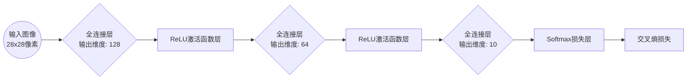
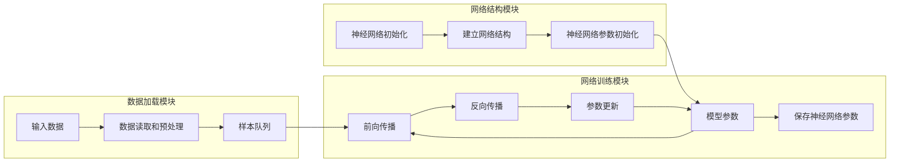
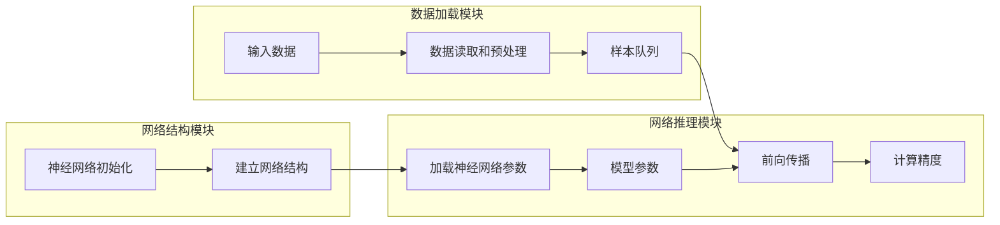
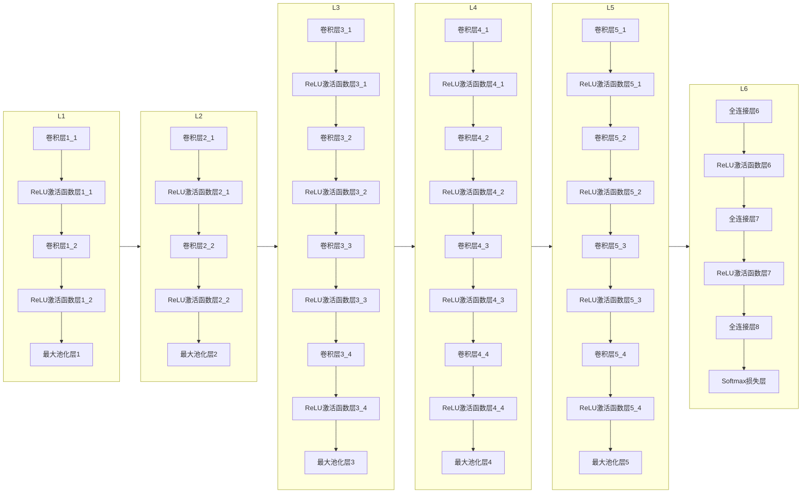

# 基于Pytorch实现神经网络

## 快速跳转

- [Mnist训练和推理](#Mnist训练和推理)
- [VGG19模型推理](#VGG19模型推理)

## 模型下载

```bash
cd assets
wget http://www.vlfeat.org/matconvnet/models/beta16/imagenet-vgg-verydeep-19.mat
```

***

## Mnist训练和推理

网络结构：


训练流：


推理流：


### 基于Numpy手动实现

- [mnist_manul](mnist_manul/)

### 基于Pytorch框架实现

- [mnist_pytorch](mnist_pytorch/)

## VGG19模型推理

网络结构：


### 基于Numpy手动实现

- [vgg19_manul](vgg19_manul/)

### 基于Pytorch框架实现

- [vgg19_pytorch](vgg19_pytorch/)

## Updating...
